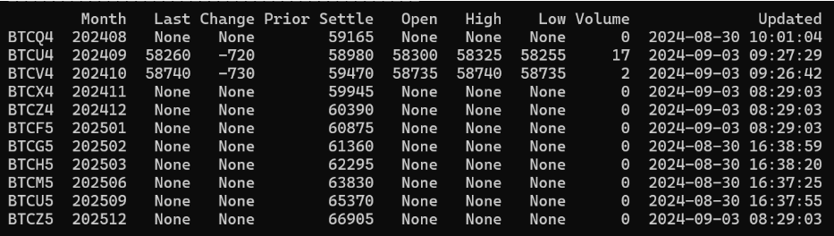
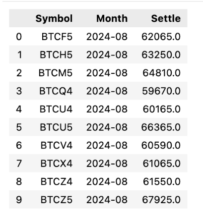
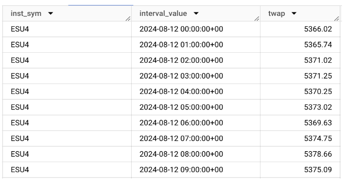

# DART : Data and Analytics Resource Toolkit

# Overview

This repo provides sample code in Python/SQL to help onboard CME Group’s clients with its products and data. Various use cases are discussed for different data sources and types. Check out the [CME Group Product Slate](https://www.cmegroup.com/markets/products.html) for all products.

# Streaming Data

Real-time streaming data related to CME Group products can be accessed via the WebSocket API and Reference Data API.

## Prerequisites

For connecting to the WebSocket API and Reference Data API, an OAuth API ID and a password is required. The API ID must be created and entitled as described here [CME Market Data Over WebSocket API](https://cmegroupclientsite.atlassian.net/wiki/spaces/EPICSANDBOX/pages/46443658/CME+Market+Data+Over+WebSocket+API\#Onboarding-and-Entitlements) & [CMEReferenceDataAPIVersion3](https://cmegroupclientsite.atlassian.net/wiki/spaces/EPICSANDBOX/pages/46114039/CME+Reference+Data+API+Version+3\#CMEReferenceDataAPIVersion3-RestrictedAccess).

**NOTE:** A password is also created during the API ID creation process. Remember to save it at a secure location.

Once, the API ID is created and entitled, add a configuration file with the following parameters:

1. auth\_url \- OAuth authorization server endpoint  
2. client\_id \- API ID  
3. client\_secret \- API password  
4. websocket\_url \- websocket API endpoint  
5. refdata\_url \- refdata API endpoint  
6. product\_sub \- The product code for the product of interest
7. security\_type \- The security type for the product (FUT or OPT)

How to load the config file into a python object:
```
import json

config_file = open('config.json')
config = json.load(config_file)
```

## Use Cases

### Create Websocket Connection

File location: python/websocket\_connection.py

Description: Creates a connection to the websocket to allow the user to derive real-time data.

Inputs: config (json representation of the config file)

Outputs: the Websocket object for further communication / requests

```
ws = websocket_request(config)
```

### Send Request to Refdata API

File location: python/refdata\_connection.py

Description: Creates a connection to the reference data API that provides real time access to CME product and instrument referential data

Inputs: endpoint (either products or instruments), config (json representation of the config file)

Output: the json object containing the reference data API response

```
refdata = refdata_request('/products',config)
```

### Get the data in pandas dataframe

File location: python/process\_data.py

Description: Allow the user to query specific data tables depending on their choice of subscription (TRD, STAT, etc) and transform those results to a pandas dataframe.

Inputs: websocket\_data (json data from the websocket API), config (json representation of the config file), dict\_result (optional - dictionary to store websocket results), active\_globex\_symbols (optional - list of active globex instruments)

Output: the dataframe containing a row of the websocket data

```
ws = websocket_request(config)
send_subscription_message(ws,config)
message = ws.recv()
data = json.loads(message)
print(process_data(data,config))
```

### Stream data in real-time

File location: python/realtime\_streaming.py

Description: Continuously fetch real-time data and add it to a list

Inputs: ws (the websocket object), config (json representation of the config file), duration (the duration for which data should be streamed)

Outputs: the list containing all the received messages

```
ws = websocket_request(config)
print(realtime_streaming(ws,config,10))
```

### Quotes Table

File location: python/quotes\_table.py

Description: Recreate the [quotes table](https://www.cmegroup.com/markets/cryptocurrencies/bitcoin/bitcoin.quotes.html) with all active instruments for a product of the user’s choosing.

Inputs: config (json representation of the config file), duration (the duration after which the quotes table is returned)

Output: the dataframe representing the quotes table 

```
# print(quotes_table(config,10))
```

Example:  


### Settlements Table

Description: Get the most recent settlement price for each active Globex symbol for each month for a product of the user’s choosing.  

Inputs: ws (the websocket object), active_globex_symbols (called from and returned by the get_active_instruments helper function). Product returned depends on prior subscription parameter.

Output: the dataframe representing the settlements table

Example Output: (DataFrame)  


```
ws = websocket_request(config)
send_subscription_message(ws, config)
active_globex_symbols = get_active_instruments(config)
print(get_settlements_data(ws,active_globex_symbols))
```

# Historical Data

Historical data for CME Market Depth can be accessed through a linked dataset subscription to Google Analytics Hub on GCP.

## Prerequisites

Please refer to [Historical Market Depth Data on Google Cloud Platform](https://cmegroupclientsite.atlassian.net/wiki/spaces/EPICSANDBOX/pages/46115012/CME+Historical+Market+Depth+Data+on+Google+Cloud+Platform) to get onboarded with the Google Analytics Hub.

## Use Cases

### Volume-weighted Average Price and Time-weighted Average Price (VWAP/TWAP) Calculations

TWAP Calculations  
File location: SQL/TWAP.sql   
Time weighted average price  


VWAP Calculations  
File location: SQL/VWAP.sql  
Volume weighted average price  


Inputs: 

* Intervals: desired granularity of calculations returned  
  * String: accepted values \[‘day’, ‘hour’, ‘minute’\]  
* Run\_dates: dates desired to analyze  
  * List of DateTime values  
* Run\_symbols: symbols desired to analyze  
  * List of strings

Output: Bigquery query table of TWAP/VWAP calculations in chronological order  
 ordered by instruments  
Example output: 

