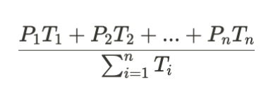
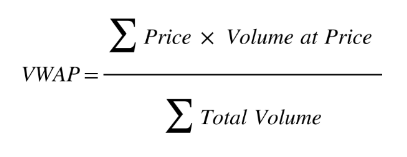

# DART : Data and Analytics Resource Toolkit

# Respository Structure

The directory structure of the project looks like the following:
```
├── src/                     <-  Contains all code and resources

    ├── main/                

      ├── sql/               <-  Contains SQL code

     ├── resources           <-  Contains resources referred in the documentation

├── .gitignore               <-  Files that are not to be tracked by Git.

└── README.md                <-  Top-level documentation page for this repository. 
```

# Overview

This repo provides sample code in SQL to help onboard CME Group’s clients with its products and data. Various use cases are discussed for different data sources and types. Check out the [CME Group Product Slate](https://www.cmegroup.com/markets/products.html) for all products.

# Historical Data

Historical data for CME Market Depth can be accessed through a linked dataset subscription to Google Analytics Hub on GCP.

## Prerequisites

Please refer to [Historical Market Depth Data on Google Cloud Platform](https://cmegroupclientsite.atlassian.net/wiki/spaces/EPICSANDBOX/pages/46115012/CME+Historical+Market+Depth+Data+on+Google+Cloud+Platform) to get onboarded with the Google Analytics Hub.

## Use Cases

### Volume-weighted Average Price and Time-weighted Average Price (VWAP/TWAP) Calculations

TWAP Calculations  
File location: src/main/sql/TWAP.sql   
Time weighted average price  


VWAP Calculations  
File location: src/mian/sql/VWAP.sql  
Volume weighted average price  


Inputs: 

* Intervals: desired granularity of calculations returned  
  * String: accepted values \[‘day’, ‘hour’, ‘minute’\]  
* Date\_range: date range desired to analyze  
  * List of 2 DateTime values  
* Run\_symbols: symbols desired to analyze  
  * List of strings

Output: Bigquery query table of TWAP/VWAP calculations in chronological order  
 ordered by instruments  
Example output: 


# License

This project is licensed under the terms of the BSD 3-Clause License.
